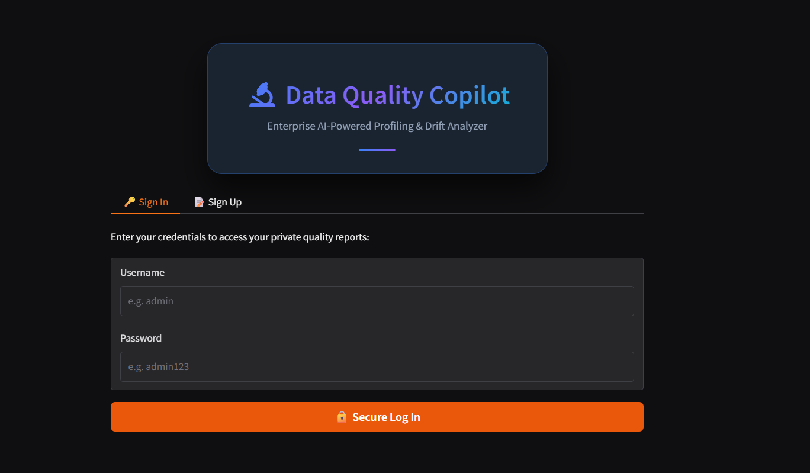
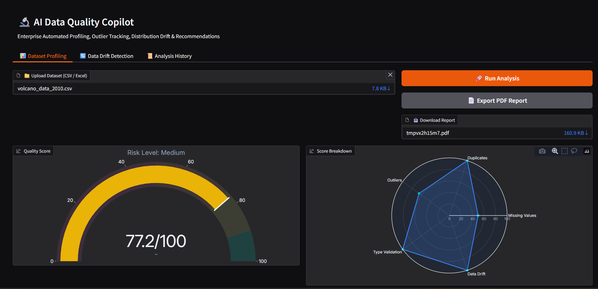
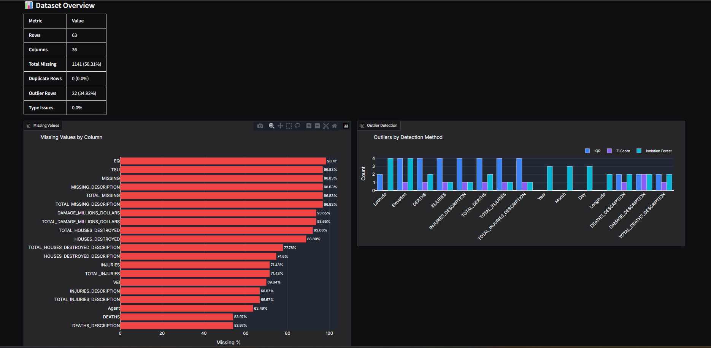
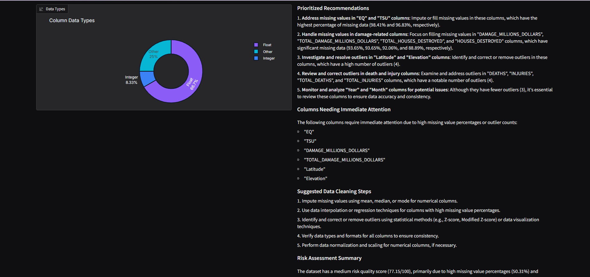
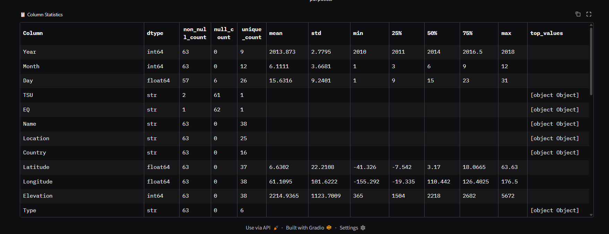
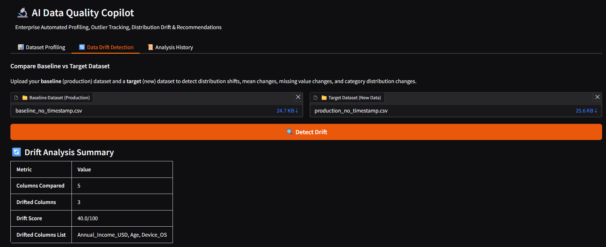
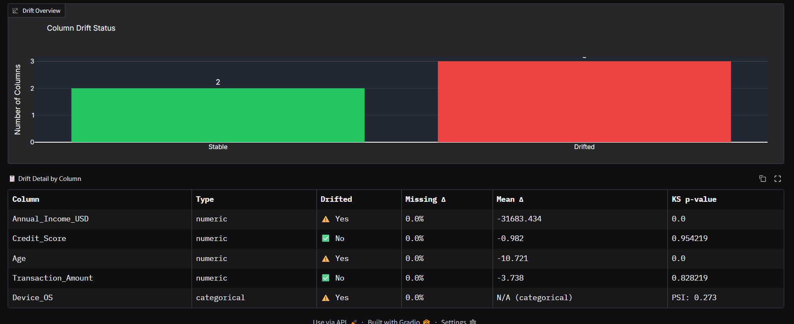
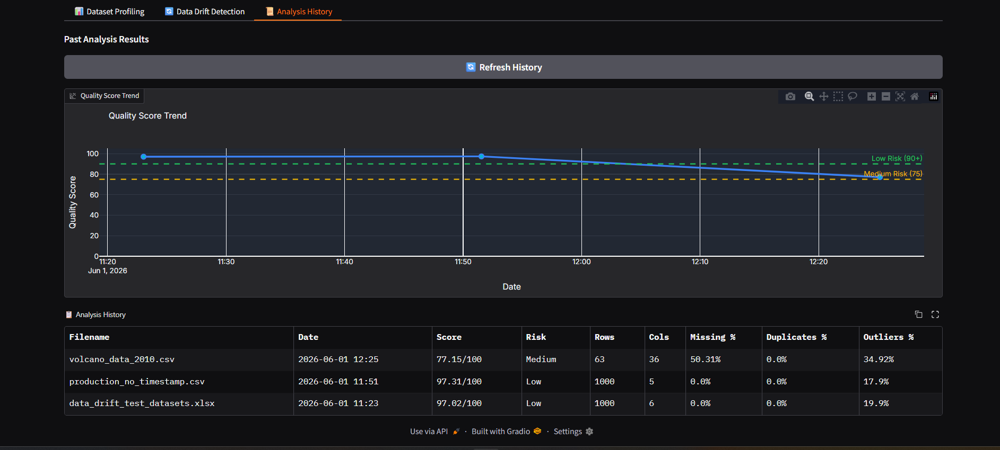

# AI Data Quality Copilot

A production-grade **data quality analysis system** that automatically profiles datasets, detects quality issues, and generates AI-powered insights with visual dashboards and reports.

---

## 📌 Overview

AI Data Quality Copilot helps engineers and analysts quickly evaluate dataset health before using it in analytics or machine learning pipelines.

It performs automated checks on uploaded CSV/Excel files and provides:

- Data profiling
- Missing value analysis
- Duplicate detection
- Outlier detection
- Data drift detection (baseline vs current dataset)
- Quality scoring (0–100)
- AI-generated recommendations
- Interactive dashboard
- PDF report export
- Persistent analysis history

---
https://data-quality-latest.onrender.com/

## 🖥️ Demo

## Screenshots










---

## ⚙️ System Architecture

```text
Upload Dataset
      ↓
FastAPI Backend
      ↓
Data Processing (Pandas / Scikit-learn)
      ↓
Quality Engine (Scoring + Drift + Outliers)
      ↓
AI Layer (Groq)
      ↓
Gradio Dashboard + Plotly Visualizations
      ↓
PostgreSQL (Neon) Storage
```

---

## 🚀 Features

### Dataset Analysis

* CSV / Excel upload support
* Automatic schema detection
* Column profiling (types, nulls, uniqueness)

### Data Quality Engine

* Missing value detection
* Duplicate detection
* Outlier detection (IQR / Z-score / Isolation Forest)
* Data type validation
* Data drift comparison

### Scoring System

* Weighted quality score (0–100)
* Risk classification (Low / Medium / High)

### AI Insights

* Groq-powered analysis summary
* Recommendations for data cleaning
* Priority-based issue breakdown

### Dashboard

* Interactive Plotly visualizations
* Missing value heatmaps
* Distribution charts
* Quality breakdown metrics

### Reports

* Auto-generated PDF reports
* Downloadable analysis summary

---

## 🧰 Tech Stack

**Frontend**

* Gradio
* Plotly

**Backend**

* FastAPI
* Uvicorn

**Data / ML**

* Pandas
* NumPy
* Scikit-learn
* SciPy

**AI Layer**

* Groq API

**Database**

* PostgreSQL (Neon)

**DevOps**

* Docker
* Render

---

## 🏗️ Project Structure

```text
backend/
  ├── main.py
  ├── database.py
  ├── models/
  ├── services/

frontend/
  ├── app.py

run.py
requirements.txt
Dockerfile
.env
```

---

## 🔐 Environment Variables

```env
NEON_POSTGRESS_SQL_CONNECTION=your_neon_db_url
GROQ_API_KEY=your_groq_api_key
APP_USERS=admin:admin123
```

---

## ▶️ Run Locally

```bash
python -m venv venv
venv\Scripts\activate   # Windows
source venv/bin/activate

pip install -r requirements.txt
python run.py
```

App runs at:

```text
http://localhost:8080
```

---

## 🐳 Run with Docker

```bash
docker build -t ai-data-quality-copilot .
docker run -p 8080:8080 --env-file .env ai-data-quality-copilot
```

---

## ☁️ Deployment (Google Cloud Run)

```bash
gcloud builds submit --tag gcr.io/PROJECT_ID/data-quality-copilot

gcloud run deploy data-quality-copilot \
  --image gcr.io/PROJECT_ID/data-quality-copilot \
  --platform managed \
  --region us-central1 \
  --allow-unauthenticated
```

---

## 📊 What This Project Demonstrates

* Real-world data engineering pipeline
* ML-based anomaly detection
* Data quality scoring system design
* AI integration (LLM + structured output)
* Full-stack FastAPI architecture
* Interactive data visualization
* Production deployment with Docker + GCP

---

## ⚠️ Key Design Highlights

* Designed for real-world messy datasets
* Combines rule-based + ML-based validation
* Modular backend architecture
* Cloud-ready deployment
* Scalable scoring engine

---

## 📄 License

AKSHAY KAKADE

---


